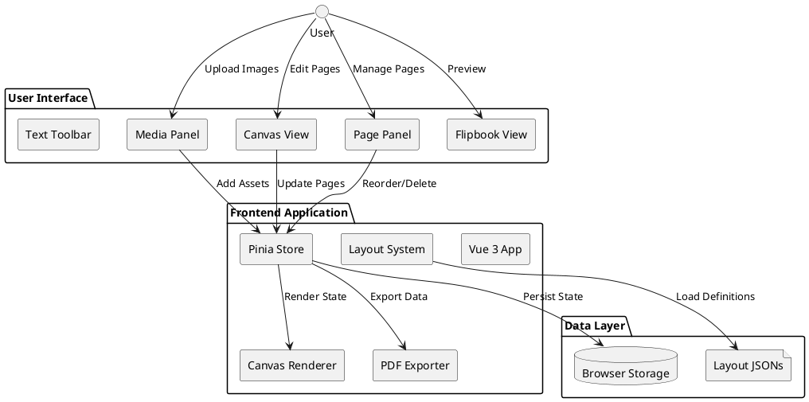
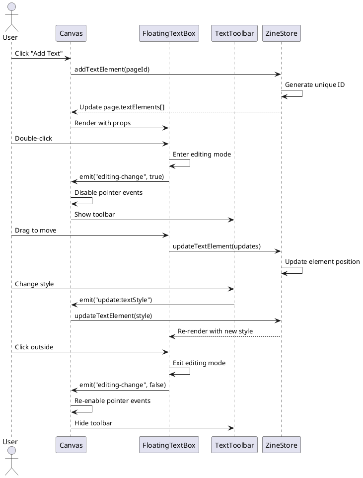
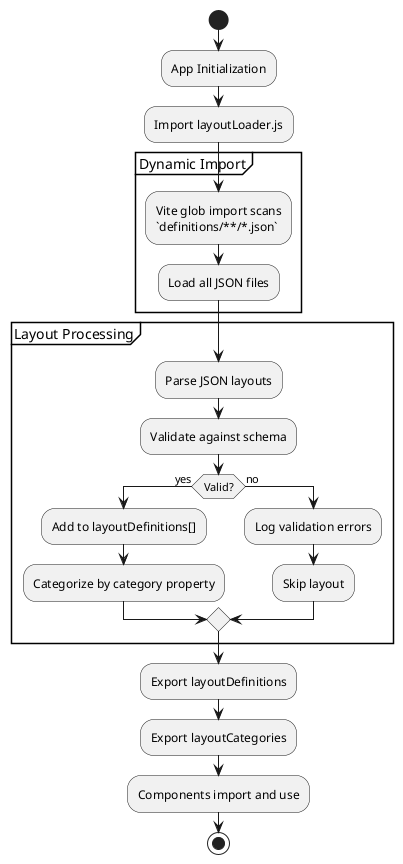
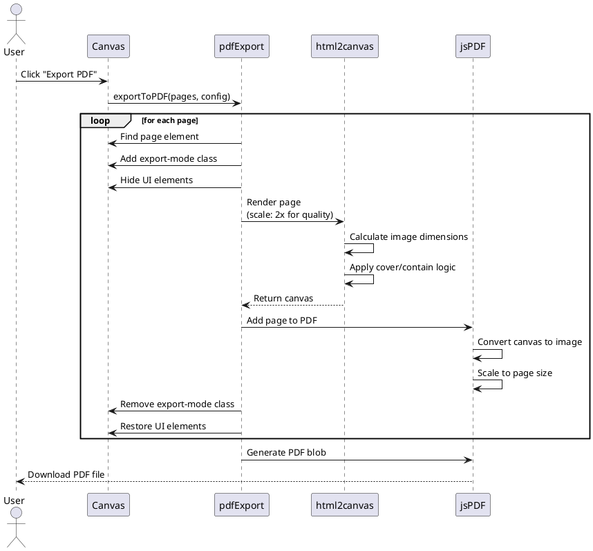

# 📚 Zine Editor

A modern, browser-based zine creation tool with flexible layouts, image management, text overlays, and professional PDF export capabilities. Create magazine-style publications with ease.

## ✨ Features

### Core Features
- **Custom Page Dimensions**: Create zines with specific dimensions in mm or px
- **Page Configuration**: Set bleed and margin properties for professional printing
- **Media Pool**: Upload and manage image assets with thumbnail previews
- **Extensible Layouts**: 15+ pre-built page layouts across 4 categories
- **Postcard Defaults**: New projects default to a 148×100 mm postcard preset for quick iteration
- **Drag & Drop**: Intuitive drag-and-drop interface for adding images to pages
- **Page Reordering**: Easily reorder pages in your zine
- **PDF Export**: High-resolution PDF generation with proper scaling
- **Modern UI**: Clean, responsive interface with smooth interactions

### Layout System
- **Basic Layouts**: Full page, split columns, grids
- **Editorial Layouts**: Magazine-style with sidebars and asymmetric grids
- **Grid Layouts**: 2x2, 3x3, 2x3 configurations
- **Combined Layouts**: Pre-designed image + text overlay combinations
  - Magazine Spread with number overlays
  - Hero + Caption for dramatic images
  - Split Screen for numbered features
  - Minimalist Feature for clean designs
  - Editorial Stack for article layouts

### Image & Text Features
- **Image Slot Controls**:
  - Toggle between Cover and Contain fit modes
  - Adjustable inner margins (0-100px)
  - Solid color backgrounds for graphic design
  - Manual dimension calculation for PDF export
- **Floating Text Boxes**:
  - Drag, resize, and position anywhere on the page
  - Rich text styling (font, size, weight, color, alignment)
  - Background colors and padding
  - Vertical text support
  - Letter spacing and shadows
  - Lock/unlock functionality
  - Hover-to-show controls

### Flipbook Preview
- **Interactive Page Flip**: Realistic book flip animation
- **Binding Modes**:
  - Folded binding (fold along vertical crease)
  - Flat binding (separate pages)
- **Live Preview**: Real-time rendering of designed pages

## Tech Stack

- **Vue 3** - Progressive JavaScript framework
- **Pinia** - State management
- **Vite** - Build tool and dev server
- **jsPDF** - PDF generation
- **HTML2Canvas** - Canvas rendering

## Getting Started

### Installation

```bash
npm install
```

### Development

```bash
npm run dev
```

The app will be available at `http://localhost:3000`

### Backend Metadata Service

The project includes a lightweight Express backend for storing book metadata JSON snapshots.

```bash
cd server
npm install
npm run dev
```

This starts the service on `http://localhost:4876`.

#### API Endpoints

- **GET `/health`** – Service heartbeat check.
- **GET `/books`** – Returns a list of saved books (id, title, timestamps).
- **GET `/books/:id`** – Loads the full JSON payload for a specific book.
- **POST `/books`** – Saves (or overwrites) a book. Body fields: `id`, `title`, `data`, `metadata` (optional). Automatically tracks `createdAt`/`updatedAt`.
- **DELETE `/books/:id`** – Removes the stored JSON for a book.

All book JSON files are stored under `server/data/books/`.

#### Frontend Configuration

The frontend expects the backend URL in `VITE_API_BASE_URL` (defaults to `http://localhost:4876`). Create a `.env` file in the project root if you need to override it:

```
VITE_API_BASE_URL=http://localhost:4876
```

### Build

```bash
npm run build
```

## Usage

1. **Initialize Zine**: Set page dimensions, bleed, and margin (or use presets like A4, A5, Letter)
2. **Upload Media**: Add images to the media pool
3. **Add Pages**: Select layouts from the toolbar to create pages
4. **Design**: Drag images from the media pool to page placeholders
5. **Reorder**: Drag pages in the right panel to reorder them
6. **Export**: Click "Export PDF" to download your zine

## 🏗️ Architecture

### System Overview



### Component Interaction Flow



### Layout Loading Flow



### PDF Export Process



## 📁 Project Structure

```
ziner/
├── src/
│   ├── components/
│   │   ├── Canvas.vue              # Main canvas with page rendering
│   │   ├── CommandBar.vue          # Top toolbar with actions
│   │   ├── FlipBook.vue            # Interactive flipbook preview
│   │   ├── FloatingTextBox.vue     # Draggable/resizable text overlay
│   │   ├── Header.vue              # App header
│   │   ├── InitModal.vue           # Zine initialization dialog
│   │   ├── MediaPanel.vue          # Media asset management
│   │   ├── PagePanel.vue           # Page overview & reordering
│   │   └── TextToolbar.vue         # Floating text styling toolbar
│   ├── layouts/
│   │   ├── definitions/            # JSON layout files
│   │   │   ├── basic/
│   │   │   │   ├── full-page.json
│   │   │   │   ├── two-horizontal.json
│   │   │   │   └── ...
│   │   │   ├── editorial/
│   │   │   │   └── ...
│   │   │   ├── grid/
│   │   │   │   └── ...
│   │   │   └── combined/
│   │   │       ├── halloween-spread.json
│   │   │       ├── hero-caption.json
│   │   │       └── ...
│   │   ├── schema.json             # JSON Schema for layouts
│   │   ├── layoutLoader.js         # Dynamic layout importer
│   │   └── layoutDefinitions.js    # Legacy (to be deprecated)
│   ├── stores/
│   │   └── zineStore.js            # Pinia state management
│   ├── utils/
│   │   └── pdfExport.js            # PDF generation logic
│   ├── App.vue                     # Root component
│   ├── main.js                     # App entry point
│   └── style.css                   # Global styles
├── server/
│   ├── data/books/                 # Stored book JSON files (gitignored)
│   ├── package.json                # Backend dependencies
│   └── src/index.js                # Express metadata API
├── public/                         # Static assets
├── README.md                       # This file
├── LAYOUT_SPEC.md                  # Layout JSON specification
├── package.json                    # Dependencies
└── vite.config.js                  # Vite configuration
```

## 📐 Layout System

### JSON-Based Layout Definitions

Layouts are now defined as JSON files in `src/layouts/definitions/`, organized by category. This enables:
- Easy extension and customization
- Schema validation
- Hot-reloading during development
- Future backend integration

### Layout Schema

See [`src/layouts/schema.json`](src/layouts/schema.json) for the complete JSON Schema specification.

**Basic Structure:**
```json
{
  "id": "unique-layout-id",
  "name": "Display Name",
  "icon": "📄",
  "category": "basic|editorial|grid|combined",
  "slots": [
    {
      "x": 0,
      "y": 0,
      "width": 100,
      "height": 100,
      "type": "image"
    }
  ],
  "textElements": [],
  "aspectRatio": {
    "min": 1.0,
    "max": 2.0
  }
}
```

### Creating Custom Layouts

1. Create a JSON file in the appropriate category folder
2. Follow the schema specification
3. Add unique ID and descriptive name
4. Define slots with percentage-based positioning
5. (Optional) Add pre-positioned text elements
6. The layout will be automatically loaded

**Example:**
```json
{
  "id": "my-custom-layout",
  "name": "My Custom Layout",
  "icon": "✨",
  "category": "basic",
  "slots": [
    { "x": 0, "y": 0, "width": 60, "height": 100, "type": "image" },
    { "x": 60, "y": 0, "width": 40, "height": 50, "type": "image" },
    { "x": 60, "y": 50, "width": 40, "height": 50, "type": "image" }
  ]
}
```

## 🚀 Future Roadmap

### Phase 1: Backend Integration (Q2 2025)
- **User Accounts & Authentication**
  - OAuth integration (Google, GitHub)
  - User profiles and preferences
- **Project Management**
  - Save/load projects from cloud
  - Version history and autosave
  - Project sharing and collaboration
- **Asset Library**
  - Cloud storage for media assets
  - Shared asset libraries
  - Stock image integration

### Phase 2: Layout Builder (Q3 2025)
- **Visual Layout Editor**
  - Drag-and-drop layout creation
  - Grid snapping and alignment guides
  - Real-time preview
- **Layout Gallery**
  - Browse community layouts
  - Rate and favorite layouts
  - One-click import
- **Layout Templates**
  - Pre-built template collections
  - Industry-specific templates
  - Seasonal and themed layouts

### Phase 3: Enhanced Features (Q4 2025)
- **Aspect Ratio Filtering**
  - Layouts adapt to page dimensions
  - Show only compatible layouts
  - Smart layout recommendations
- **Advanced Text Features**
  - Text flow between boxes
  - Drop caps and pull quotes
  - Text on path
- **Collaboration Tools**
  - Real-time co-editing
  - Comments and annotations
  - Change tracking

### Phase 4: Professional Tools (Q1 2026)
- **Print Production**
  - CMYK color mode
  - Crop marks and bleeds
  - Print-ready PDF/X-4 export
- **Typography Enhancements**
  - Custom font uploads
  - OpenType features
  - Kerning and tracking controls
- **Advanced Export**
  - Multi-format export (PNG, SVG, INDD)
  - Batch export
  - Custom export presets

## 🤝 Contributing

We welcome contributions! Please see `CONTRIBUTING.md` for guidelines.

### Development Guidelines
- Follow Vue 3 Composition API patterns
- Use TypeScript for type safety (future migration)
- Write unit tests for utilities
- Update PlantUML diagrams when changing architecture
- Document new layout schemas

## 📚 Documentation

- **[Layout Specification](LAYOUT_SPEC.md)** - Detailed layout JSON schema
- **[API Documentation](docs/API.md)** - Store methods and utilities
- **[Component Reference](docs/COMPONENTS.md)** - Component props and events
- **[Architecture Guide](docs/ARCHITECTURE.md)** - In-depth technical details

## License

MIT
